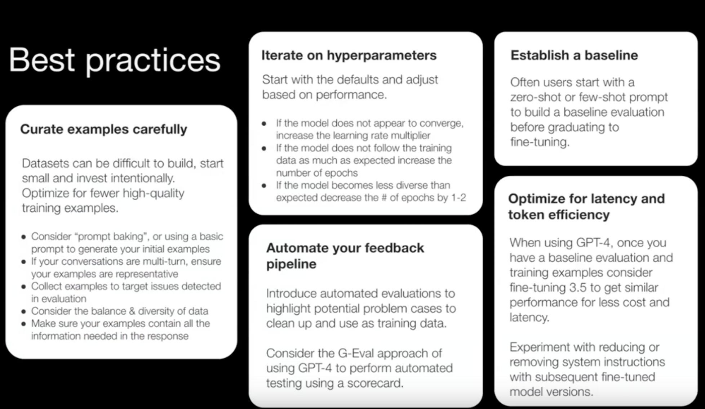

# av-hack-panel

## When Finetuning is a good option?
|   | FineTuning ✅                         | Finetune ❌                                       |
|---|--------------------------------------|--------------------------------------------------|
| 1 | Follow output structure format       | Teaching new knowledge.                          |
| 2 | Following complex input instructions | Improving on multiple unrelated tasks.           |
| 3 | Improving Latency                    | Keeping the model up-to-date                     |
| 4 | Output Precision, low token usage                     | Limited or low quality data and limited compute. |

## Fine-tuning Best Practices 

